# Krosmoz Codex Minis

Original animated **Dofus / Wakfu / Krosmoz fan-art minis for Codex**, made by a
huge fan of Ankama's universe. This repository is being reviewed privately
before any public release. Nothing here is official Ankama or OpenAI artwork.

**Original characters and intellectual property: Ankama Games / Ankama.**
See [credits](CREDITS.md), [code license](LICENSE), and [artwork scope](assets/README.md).

## Animated gallery

Only fully validated, installable minis appear here. Each preview cycles through
the mini's actual animation frames; each native package includes nine animation
states and sixteen look directions. Installation names match the catalog exactly.

<!-- gallery:start -->
| Animated mini | Name | Install name |
| --- | --- | --- |
| 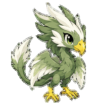 | Aerafal | `aerafal` |
| 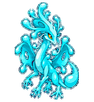 | Aguabrial | `aguabrial` |
| 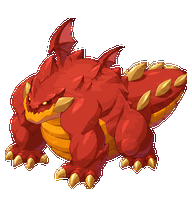 | Ignemikhal | `ignemikhal` |
| 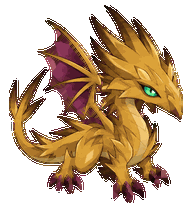 | Terrakourial | `terrakourial` |
| 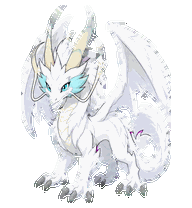 | Dardondakal | `dardondakal` |
| 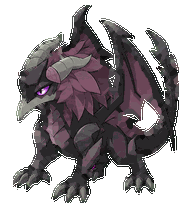 | Grougalorasalar | `grougalorasalar` |
|  | Emerald Dofus | `dofus-emerald` |
| 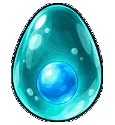 | Turquoise Dofus | `dofus-turquoise` |
| 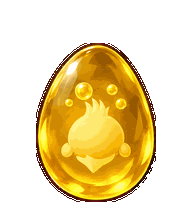 | Ochre Dofus | `dofus-ochre` |
| 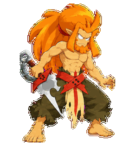 | Goultard | `goultard` |
| 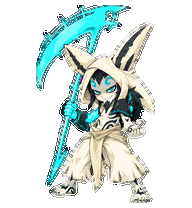 | Qilby | `qilby` |
| 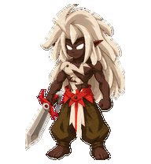 | Goultard (Dark) | `goultard-dark` |
| 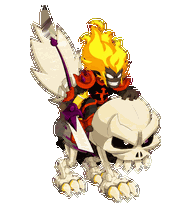 | Dark Vlad | `dark-vlad` |
<!-- gallery:end -->

## Install

Requirements: **Python 3.9+** and a Codex desktop version that supports custom
v2 pets. The installer runs on Windows, macOS, and Linux; availability of the
Codex app itself depends on your platform and version.

First clone the repository. During private review you need repository access
and the [GitHub CLI](https://cli.github.com/):

```sh
gh auth login
gh repo clone AlexIn-Tech/Krosmoz-Codex-Minis
cd Krosmoz-Codex-Minis
```

After a public release, a regular clone also works:

```sh
git clone https://github.com/AlexIn-Tech/Krosmoz-Codex-Minis.git
cd Krosmoz-Codex-Minis
```

List completed pets:

```sh
python install.py --source . --list
```

Use a name from the animated gallery (replace `<pet-name>` below):

| Platform | Install from your clone |
| --- | --- |
| Windows PowerShell | `./install.ps1 <pet-name> --source .` |
| macOS / Linux | `sh ./install.sh <pet-name> --source .` |
| Any OS | `python install.py <pet-name> --source .` |

Once you have a copy of the installer, it can fetch a pet directly from GitHub:

```sh
# Authenticated access while this repository is private:
python install.py <pet-name> --private
# Public access after you choose to publish:
python install.py <pet-name>
# Validate without installing; use --source . for a local clone:
python install.py <pet-name> --source . --dry-run
```

On macOS/Linux use `python3` if `python` is unavailable. Native wrappers detect
an available Python command. The remote installer resolves `--ref` (default:
`main`) to one commit before downloading, and verifies package SHA-256 hashes.
Hashes detect corruption and mismatched files; trust still comes from the
repository and the commit you choose. For reproducible installs, use
`--ref <commit-or-tag>`. Inspect scripts before running downloaded code.

Packages install under `${CODEX_HOME:-~/.codex}/pets/<pet-name>`.
You can override this with `--codex-home <folder>`. Existing pets are preserved
unless you explicitly pass `--force`. Restart Codex if needed, then select your
mini in the pet picker. Installation does not change your selected pet or other
Codex settings. If PowerShell execution policy blocks a script, use the Python
command above; no execution-policy change is required.

## Planned collection

- **Primordial Dofus:** Crimson Dofus (`dofus-crimson`), Ivory Dofus (`dofus-ivory`), Ebony Dofus (`dofus-ebony`).

Planned names reserve the future installation slugs. They are not downloadable
until their complete animations pass QA and appear in the gallery.

## Ideas

Toross Mordal (`toross-mordal`), Yugo (`yugo`), Adamai (`adamai`), Nox (`nox`), Ogrest (`ogrest`), Dathura (`dathura`), Percedal (`percedal`), Evangelyne (`evangelyne`), Amalia (`amalia`), Ruel (`ruel`), Joris (`joris`), Kerubim (`kerubim`), Julith (`julith`), Ush (`ush`).

These character ideas are deferred. Reference images will be supplied gradually
before generation resumes. Existing completed minis stay in the gallery;
unfinished private base drawings are preserved for future work.

## Development and quality

```sh
python -m pip install -r requirements-dev.txt
python -m unittest discover -s tests -v
python tools/gallery.py --check
python tools/validate_release.py
```

The release validator checks package hashes, manifest identity, alpha, atlas
geometry, populated animation cells, previews, and stored QA evidence. GitHub
Actions runs installer tests on Windows, macOS, and Linux. Artwork is generated
using ImageGen, assembled and reviewed with the Codex hatch-pet pipeline, then
committed one mini at a time. Local generation runs, credentials, caches, and
machine-specific paths are excluded from Git.

Contributions should preserve recognizable character designs, consistent chibi
style, genuine state-specific motion, full direction support, and Ankama credits.
Do not submit extracted game sprites, credentials, or private machine metadata.
Code is MIT licensed; that license does not grant rights to Ankama's underlying
intellectual property or the derivative character artwork.
