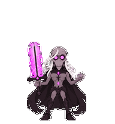
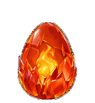
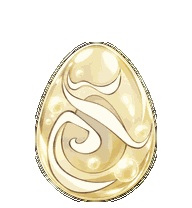
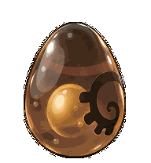

# Krosmoz Codex Minis

Unofficial animated fan art for **Codex**. This project is not affiliated with
or endorsed by Ankama or OpenAI. See [credits](CREDITS.md).

## Animated minis

Choose a mini below. Each preview shows its animations. Use the code beneath it
as the install name.

<!-- gallery:start -->
### Goultard, Qilby & Toross Mordal

| | | | |
| --- | --- | --- | --- |
| <br><strong>Goultard</strong><br><code>goultard</code> | <br><strong>Qilby</strong><br><code>qilby</code> | <br><strong>Toross Mordal</strong><br><code>toross-mordal</code> |  |

### Dragons

| | | | |
| --- | --- | --- | --- |
| <br><strong>Ignemikhal</strong><br><code>ignemikhal</code> | <br><strong>Terrakourial</strong><br><code>terrakourial</code> | <br><strong>Dardondakal</strong><br><code>dardondakal</code> | <br><strong>Grougalorasalar</strong><br><code>grougalorasalar</code> |
| <br><strong>Aguabrial</strong><br><code>aguabrial</code> | <br><strong>Aerafal</strong><br><code>aerafal</code> |  |  |

### Dofus

| | | | |
| --- | --- | --- | --- |
| <br><strong>Emerald Dofus</strong><br><code>dofus-emerald</code> | <br><strong>Turquoise Dofus</strong><br><code>dofus-turquoise</code> | <br><strong>Crimson Dofus</strong><br><code>dofus-crimson</code> | <br><strong>Ochre Dofus</strong><br><code>dofus-ochre</code> |
| <br><strong>Ivory Dofus</strong><br><code>dofus-ivory</code> | <br><strong>Ebony Dofus</strong><br><code>dofus-ebony</code> |  |  |

### Other characters

| | | | |
| --- | --- | --- | --- |
| <br><strong>Goultard (Dark)</strong><br><code>goultard-dark</code> | <br><strong>Dark Vlad</strong><br><code>dark-vlad</code> |  |  |
<!-- gallery:end -->

## Install

Requires Python 3.9+ and a Codex desktop version with custom pet support.
Clone the repository, then run:

```sh
git clone https://github.com/AlexIn-Tech/Krosmoz-Codex-Minis.git
cd Krosmoz-Codex-Minis
python install.py --source . --list
python install.py goultard --source .
```

Replace `goultard` with any install name in the gallery. On Windows, use
`py` if `python` is unavailable; on macOS or Linux, use `python3`. Restart
Codex if needed, then choose the mini in the pet picker.

## Ideas

Yugo, Adamai, Nox, Ogrest, Dathura, Percedal, Evangelyne, Amalia, Ruel, Joris, Kerubim, Julith, Ush.

Code is licensed under MIT; that license does not cover the character artwork.
